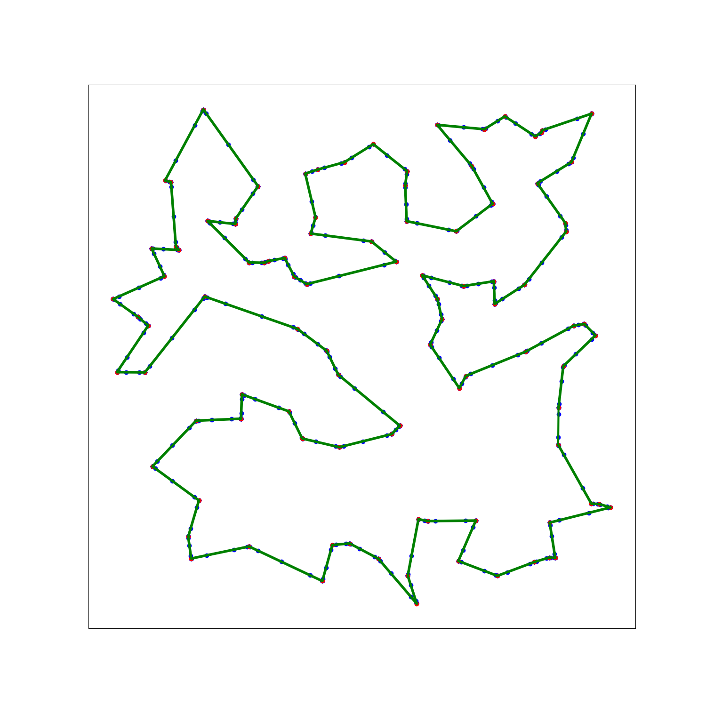

# Traveling Salesman Problem modelled with Self-Organizing Maps

In this repo, we will discover the approach of approximating the traveling salesman problem (TSP) with self-organizing maps (SOM)

### Install Prerequisites
```
pip install -r requirements.txt
```

### Solve Given Examples
```
python main.py example/example_instance_0100.json
```

#### Output of ``example/example_instance_0100.json``:


### Generate Random Examples
```
python generate_example.py 100 example.json
```

### Tune Hyperparameters (may take a long time)
```
python tune_hyperparameters.py example/example_instance_0100.json
```
